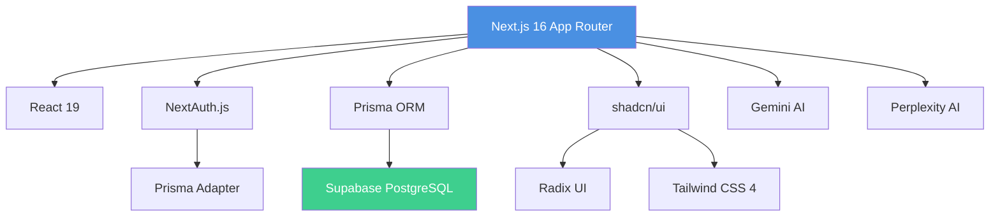
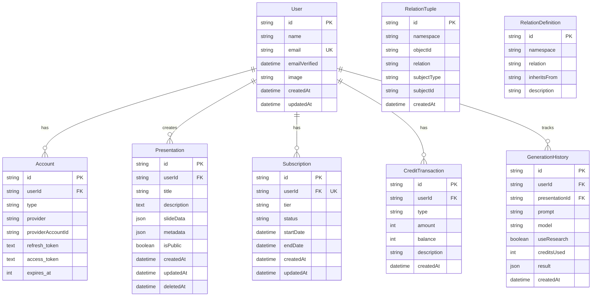
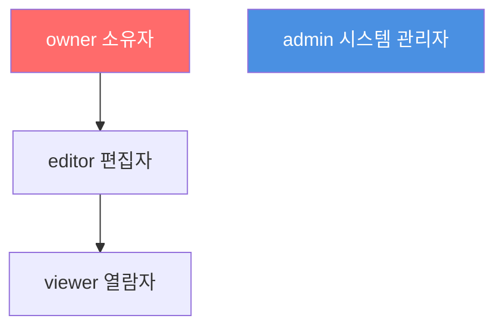
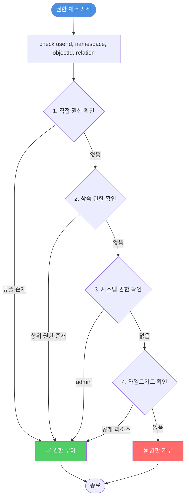
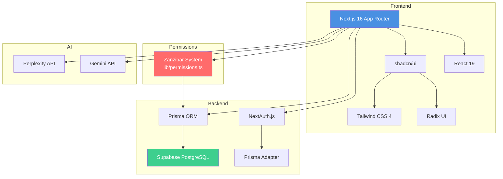
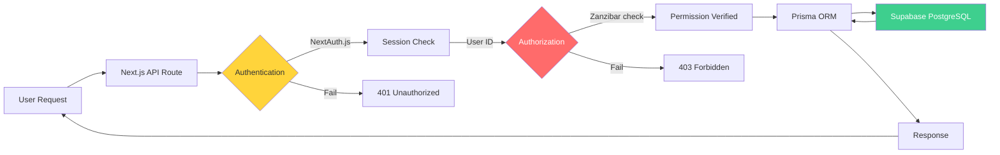

# PPT Maker - 데이터베이스 & 시스템 아키텍처

**작성일**: 2025-11-07
**버전**: 1.0
**대상**: PPT Maker 프로젝트 개발팀
**목적**: 데이터베이스 구조, Zanzibar 권한 시스템, API Routes 통합 문서

---

## 📋 목차

1. [시스템 개요](#1-시스템-개요)
2. [데이터베이스 스키마](#2-데이터베이스-스키마)
3. [Zanzibar 권한 시스템](#3-zanzibar-권한-시스템)
4. [구독 및 크레딧 시스템](#4-구독-및-크레딧-시스템)
5. [API Routes & 권한 보호](#5-api-routes--권한-보호)
6. [시스템 의존성 관계도](#6-시스템-의존성-관계도)
7. [권한 시나리오](#7-권한-시나리오)

---

## 1. 시스템 개요

### 1.1 기술 스택



### 1.2 핵심 아키텍처 결정

| 항목 | 기술/패턴 | 이유 |
|------|----------|------|
| **프레임워크** | Next.js 16 App Router | SSR, RSC, Server Actions |
| **데이터베이스** | Supabase PostgreSQL | Managed DB, Realtime, RLS |
| **ORM** | Prisma | Type-safe, Migration, Client Generation |
| **인증** | NextAuth.js | OAuth (Google, GitHub), Session Management |
| **권한 시스템** | Zanzibar (Google) | ReBAC, Scalable, Flexible |
| **UI 라이브러리** | shadcn/ui | Customizable, Accessible, Radix UI |
| **AI 서비스** | Gemini + Perplexity | Content Generation + Research |

### 1.3 비즈니스 모델

**수익 구조**:
- **구독 모델**: Free (무료), Pro (월 9,900원), Premium (가격 미정)
- **크레딧 시스템**: Pro 모델 사용, Deep Research 기능 (Pay-per-use)

**주요 기능**:
- 텍스트 → AI 프레젠테이션 생성 (21개 슬라이드 타입)
- 무제한 편집 (클라이언트 템플릿 엔진)
- 다운로드 (HTML, PDF, PowerPoint)
- 프레젠테이션 저장 및 히스토리 관리
- 공유 및 협업 (향후 구현)

---

## 2. 데이터베이스 스키마

### 2.1 전체 테이블 구조



### 2.2 테이블 상세

#### User (사용자)

```prisma
model User {
  id            String    @id @default(cuid())
  name          String?
  email         String    @unique
  emailVerified DateTime?
  image         String?

  accounts         Account[]
  presentations    Presentation[]
  subscription     Subscription?
  creditTransactions CreditTransaction[]
  generationHistory  GenerationHistory[]

  createdAt     DateTime  @default(now())
  updatedAt     DateTime  @updatedAt
}
```

**용도**: NextAuth.js 사용자 정보 저장
**관계**:
- Account와 1:N (OAuth 계정)
- Presentation과 1:N (생성한 프레젠테이션)
- Subscription과 1:1 (구독 정보)
- CreditTransaction과 1:N (크레딧 거래 이력)
- GenerationHistory와 1:N (AI 생성 이력)

---

#### Account (OAuth 계정)

```prisma
model Account {
  id                String  @id @default(cuid())
  userId            String
  type              String
  provider          String  // 'github', 'google'
  providerAccountId String
  refresh_token     String? @db.Text
  access_token      String? @db.Text
  expires_at        Int?
  token_type        String?
  scope             String?
  id_token          String? @db.Text
  session_state     String?

  user User @relation(fields: [userId], references: [id], onDelete: Cascade)

  @@unique([provider, providerAccountId])
}
```

**용도**: OAuth 인증 정보 (GitHub, Google)
**관계**: User와 N:1 관계

---

#### Presentation (프레젠테이션)

```prisma
model Presentation {
  id          String   @id @default(cuid())
  userId      String
  title       String
  description String?

  // SlideData JSON (21개 타입 지원)
  slideData   Json     // UnifiedPPTJSON 구조

  // 메타데이터
  metadata    Json?    // { totalSlides, createdWith, version, ... }
  isPublic    Boolean  @default(false)

  // 소프트 삭제
  deletedAt   DateTime?

  user        User     @relation(fields: [userId], references: [id], onDelete: Cascade)
  history     GenerationHistory[]

  createdAt   DateTime @default(now())
  updatedAt   DateTime @updatedAt

  @@index([userId])
  @@index([isPublic])
}
```

**용도**: 사용자가 생성한 프레젠테이션 저장
**SlideData 구조** (UnifiedPPTJSON):
```typescript
{
  slides: [
    {
      type: 'title' | 'content' | 'bullet' | ..., // 21개 타입
      data: { /* 타입별 데이터 */ }
    }
  ]
}
```

**Metadata 예시**:
```json
{
  "totalSlides": 10,
  "createdWith": "Gemini Flash",
  "version": "1.0",
  "researchUsed": true,
  "generationTime": 8500
}
```

---

#### Subscription (구독)

```prisma
model Subscription {
  id        String   @id @default(cuid())
  userId    String   @unique
  tier      String   // 'FREE', 'PRO', 'PREMIUM'
  status    String   // 'ACTIVE', 'CANCELED', 'EXPIRED'

  startDate DateTime
  endDate   DateTime?

  user      User     @relation(fields: [userId], references: [id], onDelete: Cascade)

  createdAt DateTime @default(now())
  updatedAt DateTime @updatedAt

  @@index([tier])
  @@index([status])
}
```

**용도**: 사용자 구독 정보 관리
**Tier 정의**:
- `FREE`: 무료 (기본 모델, 워터마크, 광고, 5슬라이드 제한)
- `PRO`: 월 9,900원 (Pro 모델, 워터마크 없음, 광고 없음, 무제한 슬라이드)
- `PREMIUM`: 가격 미정 (모든 Pro + 추가 기능)

**Status 정의**:
- `ACTIVE`: 활성 구독
- `CANCELED`: 취소됨 (만료일까지 사용 가능)
- `EXPIRED`: 만료됨

---

#### CreditTransaction (크레딧 거래)

```prisma
model CreditTransaction {
  id          String   @id @default(cuid())
  userId      String
  type        String   // 'PURCHASE', 'USAGE', 'REFUND', 'BONUS'
  amount      Int      // 증가(+) 또는 감소(-) 크레딧
  balance     Int      // 거래 후 잔액
  description String?

  user        User     @relation(fields: [userId], references: [id], onDelete: Cascade)

  createdAt   DateTime @default(now())

  @@index([userId, createdAt])
  @@index([type])
}
```

**용도**: 크레딧 충전 및 사용 이력 추적
**Type 정의**:
- `PURCHASE`: 크레딧 구매 (amount: +100)
- `USAGE`: Pro 모델 사용 (amount: -1) / Deep Research 사용 (amount: -2)
- `REFUND`: 환불 (amount: +N)
- `BONUS`: 보너스 지급 (amount: +N)

**예시**:
```json
[
  { "type": "PURCHASE", "amount": 100, "balance": 100, "description": "10,000원 충전" },
  { "type": "USAGE", "amount": -1, "balance": 99, "description": "Pro 모델 사용 (프레젠테이션 ID: abc123)" },
  { "type": "USAGE", "amount": -2, "balance": 97, "description": "Deep Research 사용 (프레젠테이션 ID: abc123)" }
]
```

---

#### GenerationHistory (AI 생성 이력)

```prisma
model GenerationHistory {
  id              String   @id @default(cuid())
  userId          String
  presentationId  String?

  // 입력
  prompt          String   @db.Text

  // AI 설정
  model           String   // 'gemini-flash', 'gemini-pro'
  useResearch     Boolean  @default(false)

  // 비용
  creditsUsed     Int      @default(0)

  // 결과
  result          Json?    // 생성된 SlideData JSON

  user            User         @relation(fields: [userId], references: [id], onDelete: Cascade)
  presentation    Presentation? @relation(fields: [presentationId], references: [id], onDelete: SetNull)

  createdAt       DateTime @default(now())

  @@index([userId, createdAt])
  @@index([presentationId])
}
```

**용도**: AI 생성 요청 이력 추적 (분석 및 비용 계산)
**Result 구조**:
```json
{
  "success": true,
  "slideData": { /* UnifiedPPTJSON */ },
  "metadata": {
    "totalSlides": 10,
    "generationTime": 8500,
    "researchQueryCount": 3
  }
}
```

---

#### RelationTuple (Zanzibar 권한 튜플)

```prisma
model RelationTuple {
  id          String   @id @default(cuid())

  namespace   String   // 'presentation', 'system'
  objectId    String   // 리소스 ID
  relation    String   // 'owner', 'editor', 'viewer', 'admin'
  subjectType String   // 'user', 'user_set'
  subjectId   String   // User ID 또는 '*' (와일드카드)

  createdAt   DateTime @default(now())

  @@unique([namespace, objectId, relation, subjectType, subjectId])
  @@index([namespace, objectId, relation])
  @@index([subjectType, subjectId])
  @@index([namespace, relation, subjectId])
  @@map("relation_tuples")
}
```

**용도**: Google Zanzibar 권한 시스템의 핵심 테이블
**튜플 형식**: `(namespace:objectId, relation, subjectType:subjectId)`
**예시**:
```
(presentation:123, owner, user:alice)   → alice는 프레젠테이션 123의 소유자
(presentation:456, editor, user:bob)    → bob은 프레젠테이션 456의 편집자
(presentation:789, viewer, user:*)      → 모든 사용자가 프레젠테이션 789 조회 가능
(system:global, admin, user:admin_user) → admin_user는 시스템 관리자
```

---

#### RelationDefinition (권한 관계 정의)

```prisma
model RelationDefinition {
  id           String  @id @default(cuid())
  namespace    String  // 'presentation', 'system'
  relation     String  // 'owner', 'editor', 'viewer', 'admin'
  inheritsFrom String? // 상속 관계 (예: 'editor' → 'viewer')
  description  String?

  @@unique([namespace, relation])
  @@map("relation_definitions")
}
```

**용도**: 권한 상속 관계 문서화
**예시**:
- `owner` relation이 `editor`를 상속
- `editor` relation이 `viewer`를 상속

---

## 3. Zanzibar 권한 시스템

### 3.1 Zanzibar 개요

Google Zanzibar는 **Relationship-Based Access Control (ReBAC)** 패턴을 사용하는 분산 권한 시스템입니다.

**핵심 개념**:
- **Tuple**: `(namespace:objectId, relation, subjectType:subjectId)` 형태의 권한 관계
- **Check API**: 권한 확인
- **Write API**: 권한 부여
- **Delete API**: 권한 제거

**참고**: [Google Zanzibar 논문 (2019)](https://research.google/pubs/pub48190/)

---

### 3.2 PPT Maker Namespace & Relation

#### Namespace (리소스 종류)

```yaml
presentation:  프레젠테이션
system:        시스템 전역
```

#### Relation (관계 종류)

```yaml
# 프레젠테이션 권한
owner:    소유자 (생성/읽기/수정/삭제)
editor:   편집자 (읽기/수정)
viewer:   열람자 (읽기)

# 시스템 레벨 권한
admin:    시스템 관리자 (모든 권한)
```

---

### 3.3 권한 상속 구조



**상속 예시**:
- `owner` 권한 보유 → `editor`, `viewer` 권한 자동 보유
- `admin` 권한 보유 → 모든 프레젠테이션에 대한 모든 권한

**구현** (`lib/permissions.ts`):
```typescript
const inheritanceMap: Record<Relation, Relation[]> = {
  viewer: [],
  editor: ['viewer'],
  owner: ['editor', 'viewer'],
  admin: [], // 시스템 레벨 권한
}
```

---

### 3.4 권한 튜플 예시

```typescript
// alice는 프레젠테이션 123의 소유자
(presentation:123, owner, user:alice)

// bob은 프레젠테이션 123의 편집자 (협업)
(presentation:123, editor, user:bob)

// 프레젠테이션 456은 모든 사용자에게 공개 (와일드카드)
(presentation:456, viewer, user:*)

// admin_user는 시스템 전체 관리자
(system:global, admin, user:admin_user)
```

---

### 3.5 권한 체크 흐름도



**권한 체크 로직** (`lib/permissions.ts:check()`):
1. **직접 권한**: `(namespace, objectId, relation, user, userId)` 튜플 조회
2. **상속 권한**: `owner` → `editor` → `viewer` 계층 확인
3. **시스템 권한**: `(system, global, admin, user, userId)` 조회
4. **와일드카드**: `(namespace, objectId, relation, user, *)` 조회

---

### 3.6 권한 API

#### Check API (권한 확인)

```typescript
export async function check(
  userId: string,
  namespace: Namespace,
  objectId: string,
  relation: Relation
): Promise<boolean>

// 예시
const canEdit = await check('alice', 'presentation', '123', 'editor')
// alice가 presentation:123을 editor로 접근 가능한가?
```

#### Write API (권한 부여)

```typescript
export async function grant(
  namespace: Namespace,
  objectId: string,
  relation: Relation,
  subjectType: SubjectType,
  subjectId: string
): Promise<RelationTuple | null>

// 예시
await grant('presentation', '123', 'owner', 'user', 'alice')
// alice에게 presentation:123의 owner 권한 부여
```

#### Delete API (권한 제거)

```typescript
export async function revoke(
  namespace: Namespace,
  objectId: string,
  relation: Relation,
  subjectType: SubjectType,
  subjectId: string
): Promise<void>

// 예시
await revoke('presentation', '123', 'editor', 'user', 'bob')
// bob의 presentation:123 editor 권한 제거
```

---

## 4. 구독 및 크레딧 시스템

### 4.1 구독 티어 비교

| 기능 | Free | Pro (월 9,900원) | Premium (미정) |
|------|------|------------------|----------------|
| **AI 모델** | Gemini Flash | Gemini Flash | Gemini Pro |
| **Deep Research** | ❌ | 크레딧 사용 | 크레딧 사용 |
| **슬라이드 제한** | 5개 | 무제한 | 무제한 |
| **워터마크** | ✅ 있음 | ❌ 없음 | ❌ 없음 |
| **광고** | ✅ 있음 | ❌ 없음 | ❌ 없음 |
| **저장 개수** | 무제한 | 무제한 | 무제한 |
| **다운로드** | HTML, PDF | HTML, PDF, PPTX | HTML, PDF, PPTX |
| **협업 (향후)** | ❌ | ✅ | ✅ |

### 4.2 크레딧 시스템

**크레딧 사용**:
- **Pro 모델 사용**: 1 크레딧
- **Deep Research 기능**: 2 크레딧

**크레딧 구매** (예시):
- 100 크레딧: 10,000원
- 500 크레딧: 45,000원 (10% 할인)
- 1,000 크레딧: 80,000원 (20% 할인)

**크레딧 잔액 조회**:
```typescript
// 가장 최근 CreditTransaction의 balance
const latestTransaction = await prisma.creditTransaction.findFirst({
  where: { userId },
  orderBy: { createdAt: 'desc' },
  select: { balance: true },
})

const currentBalance = latestTransaction?.balance ?? 0
```

---

## 5. API Routes & 권한 보호

### 5.1 권한 레벨 정의

| 레벨 | 설명 | 구현 방법 |
|------|------|-----------|
| **PUBLIC** | 인증 불필요 | 권한 체크 없음 |
| **AUTH** | 로그인 필요 | `auth()` 세션 확인 |
| **OWNER** | 리소스 소유자 | Zanzibar `check()` - owner 권한 |
| **ADMIN** | 관리자 권한 | `requireAdmin()` 미들웨어 |

---

### 5.2 Presentations API Routes

| Endpoint | Method | 권한 | 설명 |
|----------|--------|------|------|
| `/api/presentations` | GET | AUTH | 내 프레젠테이션 목록 조회 |
| `/api/presentations` | POST | AUTH | 프레젠테이션 생성 + 자동 owner 권한 부여 |
| `/api/presentations/[id]` | GET | OWNER or PUBLIC | 프레젠테이션 조회 (isPublic or owner) |
| `/api/presentations/[id]` | PATCH | OWNER | 프레젠테이션 수정 |
| `/api/presentations/[id]` | DELETE | OWNER | 프레젠테이션 삭제 (soft delete) |
| `/api/presentations/[id]/share` | POST | OWNER | 공유 권한 부여 (editor/viewer) |
| `/api/presentations/[id]/share` | DELETE | OWNER | 공유 권한 제거 |

---

### 5.3 Subscriptions API Routes

| Endpoint | Method | 권한 | 설명 |
|----------|--------|------|------|
| `/api/subscriptions/current` | GET | AUTH | 내 구독 정보 조회 |
| `/api/subscriptions` | POST | AUTH | 구독 생성/업그레이드 |
| `/api/subscriptions/cancel` | POST | AUTH | 구독 취소 |

---

### 5.4 Credits API Routes

| Endpoint | Method | 권한 | 설명 |
|----------|--------|------|------|
| `/api/credits/balance` | GET | AUTH | 크레딧 잔액 조회 |
| `/api/credits/purchase` | POST | AUTH | 크레딧 구매 |
| `/api/credits/history` | GET | AUTH | 크레딧 거래 이력 조회 |

---

### 5.5 Generation API Routes

| Endpoint | Method | 권한 | 설명 |
|----------|--------|------|------|
| `/api/generate` | POST | AUTH | AI 프레젠테이션 생성 + 크레딧 차감 |
| `/api/generate/history` | GET | AUTH | AI 생성 이력 조회 |

---

### 5.6 Admin API Routes

| Endpoint | Method | 권한 | 설명 |
|----------|--------|------|------|
| `/api/admin/stats` | GET | ADMIN | 대시보드 통계 |
| `/api/admin/users` | GET | ADMIN | 사용자 목록 |
| `/api/admin/presentations` | GET | ADMIN | 모든 프레젠테이션 조회 |
| `/api/admin/users/[id]/subscription` | PATCH | ADMIN | 사용자 구독 수정 |

---

## 6. 시스템 의존성 관계도

### 6.1 기술 스택 의존성



---

### 6.2 데이터 흐름



**흐름 설명**:
1. 사용자 요청 → Next.js API Route
2. **인증 (Authentication)**: NextAuth 세션 확인
3. **인가 (Authorization)**: Zanzibar 권한 체크
4. 권한 통과 → Prisma ORM → Supabase PostgreSQL
5. 응답 반환

---

## 7. 권한 시나리오

### 시나리오 1: 프레젠테이션 생성 및 권한 부여

**요구사항**: 사용자가 프레젠테이션을 생성하면, 자동으로 owner 권한을 부여

```typescript
// POST /api/presentations
export async function POST(request: Request) {
  const session = await auth()
  const userId = session?.user?.id

  if (!userId) {
    return NextResponse.json({ error: 'Unauthorized' }, { status: 401 })
  }

  const { title, description, slideData } = await request.json()

  // 1. 프레젠테이션 생성
  const presentation = await prisma.presentation.create({
    data: {
      userId,
      title,
      description,
      slideData,
      isPublic: false,
    },
  })

  // 2. Zanzibar 권한 부여: owner
  await grant('presentation', presentation.id, 'owner', 'user', userId)

  return NextResponse.json(presentation, { status: 201 })
}
```

**생성되는 튜플**:
```
(presentation:새프레젠테이션ID, owner, user:작성자ID)
```

---

### 시나리오 2: 프레젠테이션 수정 권한 체크

**요구사항**: owner와 editor만 프레젠테이션을 수정할 수 있음

```typescript
// PATCH /api/presentations/[id]
export async function PATCH(
  request: Request,
  { params }: { params: { id: string } }
) {
  const session = await auth()
  const userId = session?.user?.id

  if (!userId) {
    return NextResponse.json({ error: 'Unauthorized' }, { status: 401 })
  }

  // Zanzibar Check: editor 권한 확인 (owner는 editor를 상속하므로 통과)
  const canEdit = await check(userId, 'presentation', params.id, 'editor')

  if (!canEdit) {
    return NextResponse.json(
      { error: 'Forbidden: 수정 권한이 없어요.' },
      { status: 403 }
    )
  }

  const { title, description, slideData } = await request.json()

  const updatedPresentation = await prisma.presentation.update({
    where: { id: params.id },
    data: { title, description, slideData },
  })

  return NextResponse.json(updatedPresentation)
}
```

---

### 시나리오 3: 협업 권한 부여

**요구사항**: 프레젠테이션 소유자가 다른 사용자를 공동 편집자로 초대

```typescript
// POST /api/presentations/[id]/share
export async function POST(
  request: Request,
  { params }: { params: { id: string } }
) {
  const session = await auth()
  const userId = session?.user?.id

  if (!userId) {
    return NextResponse.json({ error: 'Unauthorized' }, { status: 401 })
  }

  // 1. owner만 협업자를 추가할 수 있음
  const isOwner = await check(userId, 'presentation', params.id, 'owner')

  if (!isOwner) {
    return NextResponse.json(
      { error: 'Forbidden: 소유자만 협업자를 초대할 수 있어요.' },
      { status: 403 }
    )
  }

  const { collaboratorEmail, role } = await request.json()

  // 2. 협업자 조회
  const collaborator = await prisma.user.findUnique({
    where: { email: collaboratorEmail },
  })

  if (!collaborator) {
    return NextResponse.json(
      { error: 'Not Found: 사용자를 찾을 수 없어요.' },
      { status: 404 }
    )
  }

  // 3. 협업자에게 권한 부여
  if (role === 'editor') {
    await grant('presentation', params.id, 'editor', 'user', collaborator.id)
  } else if (role === 'viewer') {
    await grant('presentation', params.id, 'viewer', 'user', collaborator.id)
  }

  return NextResponse.json({
    message: '협업자가 추가되었어요.',
    presentationId: params.id,
    collaboratorId: collaborator.id,
    role,
  })
}
```

**생성되는 튜플**:
```
(presentation:123, editor, user:협업자ID)
```

---

### 시나리오 4: 공개 프레젠테이션 조회

**요구사항**: 공개 프레젠테이션은 로그인하지 않은 사용자도 조회 가능

```typescript
// GET /api/presentations/[id]
export async function GET(
  request: Request,
  { params }: { params: { id: string } }
) {
  const session = await auth()
  const userId = session?.user?.id

  // 1. 프레젠테이션 조회
  const presentation = await prisma.presentation.findUnique({
    where: { id: params.id, deletedAt: null },
  })

  if (!presentation) {
    return NextResponse.json({ error: 'Not Found' }, { status: 404 })
  }

  // 2. 권한 체크
  if (presentation.isPublic) {
    // 공개 프레젠테이션은 누구나 조회 가능
    return NextResponse.json(presentation)
  }

  // 3. 비공개 프레젠테이션: owner, editor, viewer만 조회 가능
  if (!userId) {
    return NextResponse.json({ error: 'Unauthorized' }, { status: 401 })
  }

  const canView = await checkAny(
    userId,
    'presentation',
    params.id,
    ['owner', 'editor', 'viewer']
  )

  if (!canView) {
    return NextResponse.json({ error: 'Forbidden' }, { status: 403 })
  }

  return NextResponse.json(presentation)
}
```

---

## 8. 구현 체크리스트

### Phase 4-1: Prisma 스키마 작성
- [ ] `prisma/schema.prisma` 파일 생성
- [ ] User, Account 모델 (NextAuth.js)
- [ ] Presentation 모델
- [ ] Subscription 모델
- [ ] CreditTransaction 모델
- [ ] GenerationHistory 모델
- [ ] RelationTuple, RelationDefinition 모델
- [ ] 인덱스 최적화 설정

### Phase 4-2: Zanzibar 권한 시스템 구현
- [ ] `lib/permissions.ts` 파일 생성
- [ ] `check()` 함수 (권한 확인)
- [ ] `grant()` 함수 (권한 부여)
- [ ] `revoke()` 함수 (권한 제거)
- [ ] `checkAny()` 함수 (여러 권한 중 하나)
- [ ] 상속 로직 구현 (inheritanceMap)
- [ ] 시스템 레벨 권한 체크 추가

### Phase 4-3: API Routes 작성
- [ ] `/api/presentations/**` (생성, 조회, 수정, 삭제, 공유)
- [ ] `/api/subscriptions/**` (구독 관리)
- [ ] `/api/credits/**` (크레딧 관리)
- [ ] `/api/generate/**` (AI 생성)
- [ ] `/api/admin/**` (관리자 기능)
- [ ] 모든 API에 권한 체크 적용

### Phase 4-4: Zustand Store → Supabase 마이그레이션
- [ ] presentationStore → Supabase 데이터 연동
- [ ] subscriptionStore → Supabase 데이터 연동
- [ ] creditStore → Supabase 데이터 연동
- [ ] historyStore → Supabase 데이터 연동
- [ ] Realtime 구독 (선택)

### Phase 4-5: NextAuth.js 인증 구현
- [ ] `app/api/auth/[...nextauth]/route.ts` 생성
- [ ] Google OAuth Provider 설정
- [ ] GitHub OAuth Provider 설정
- [ ] Prisma Adapter 연결
- [ ] 세션 관리

---

## 9. 참고 문서

- [PRD.md](./SPECIFICATION.md) - 제품 요구사항 문서
- [COST_AND_REVENUE.md](./COST_AND_REVENUE.md) - 비용 및 수익 모델
- [Google Zanzibar 논문 (2019)](https://research.google/pubs/pub48190/)
- [Prisma Documentation](https://www.prisma.io/docs)
- [NextAuth.js Documentation](https://next-auth.js.org/)
- [Supabase Documentation](https://supabase.com/docs)

---

## 10. 변경 이력

| 버전 | 날짜 | 변경 사항 |
|------|------|-----------|
| 1.0 | 2025-11-07 | 초기 아키텍처 문서 작성<br>- 데이터베이스 스키마 (8개 테이블)<br>- Zanzibar 권한 시스템 구조<br>- 구독 및 크레딧 시스템<br>- API Routes & 권한 보호<br>- 시스템 의존성 관계도<br>- 권한 시나리오 (4가지) |

---

**문서 끝**
